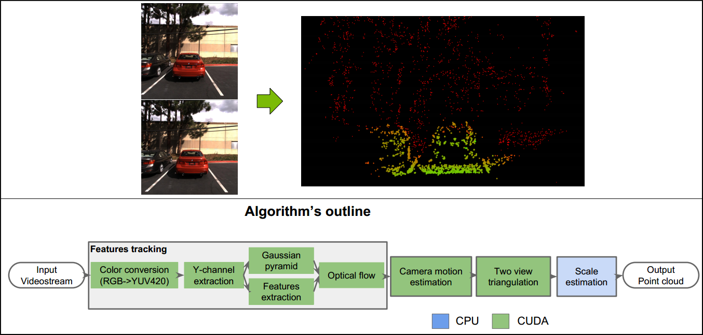
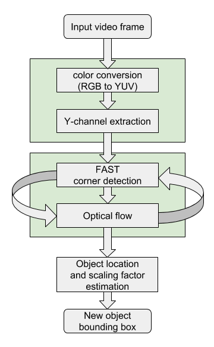
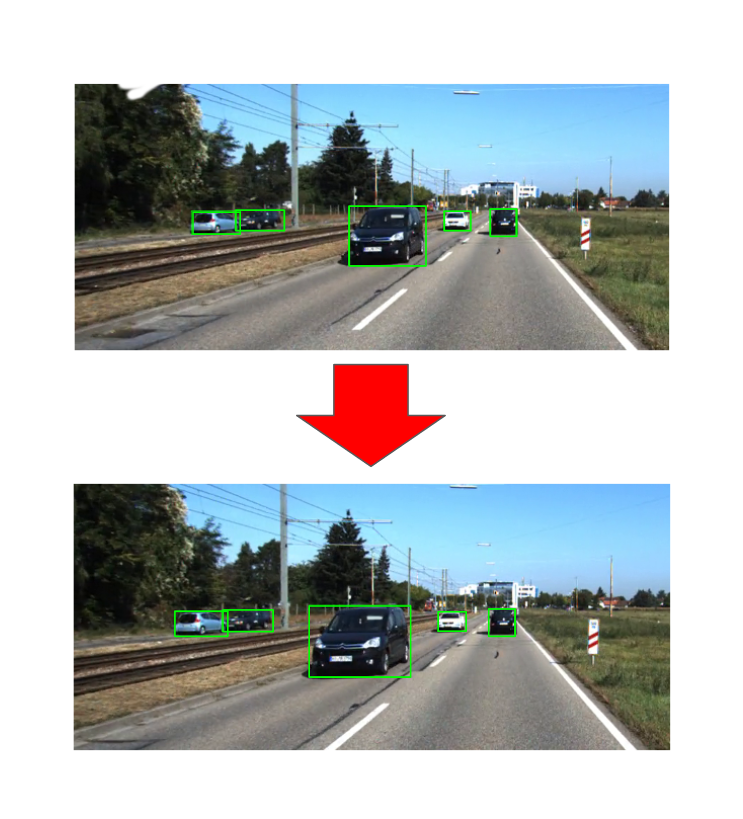

基本的数学模型
==============

相机自身的位置与当前位置下的路标的观测数据。 所以一共两个方程
一个自身的运动方程，另一个对于路标的观测方程。当相机在 :math:`x_k`
位置时，看到某个路标点 :math:`y_j` ,产生了一个观测数据 :math:`z_{k,j}`.

.. math::  运动方程 与 观测方程
   \begin{array}{lcl}
   x_k & = & f(x_{k-1},u_k,w_k) \\
   z_{k,j} & = & h(y_j,x_k,v_{k,j})
   \end{array}

:math:`x_i` 是相机自身的位姿状态 :math:`t=1,...,K` 是 :math:`u_k` 是传感器参数， :math:`w_k` 是噪声,  :math:`v_{k,j}` 是观测里的噪声。 相机检测的路标用 :math:`y_1,...,y_n` 来表示。

基本的工作流
============

SLAM 的难点，在仅通过计觉里程计算将不避免地出现累计漂移。
当然传感器本身误差不准确，以及和各种噪声的存在。为了解决漂移问题，我们采用两种技术 后端优化与回环检测。
后端优化这就要通过一个nlp优化，而回环检测，就是把机器人回到原始的位置给检测出来。

.. graphviz:: 
   
   digraph G {
	graph [layout=dot rankdir=LR];
        node [shape=box];
        sensor->vo->nlp->map[weight=10];
        sensor->loop_check->nlp;
   }

传感器
------

#. 单目摄像头，无法解决尺度问题
#. 双目， 通过视差来解决深度
#. RGB-D 深度摄像头
#. 激光雷达
#. IMU 测量自身的位姿
#. GPS 

VO
---

主要是解决，计算机是如何通过图像确定相机的运动。相机本身的旋转与平移。 主要是通过相邻帧间的图像估计相机运动。并恢复场景的空间。

#. 特征点，关键点与描述子两部分组成，相似性通过描述子的各种度量距离来计算暴力匹配，可以用汉明距离，当然还快速近假最近邻(FLANN)。 特征是图像信息的另一种数字表达式，我们的目标是要使特征点在相机运动之后保持稳定。

   CPU还无法实时计算SIFT特征。当然通过GPU加速后的SIFT，就可以满足实时计算要求。

.. csv-table::
   :header: "特征点个数","ORB(Oriented FAST and Rotated BRIEF)",SURF,SIFT

   1000,15.3.ms,217.3ms,5228.7ms.

不同的方法，角点的描述能力也不一样。

#. 单目的时候，从2D的像素坐标估计相机问题运动，对采用对极几何，多线共面的约束来求。
#. 双目 RGB-D, 两组3D点来估计运动，来求平移与旋转，就用ICP来解决。
#. 如果3D点与它们在相抽的投影位置，用PnP来估计的相机的运动。

而采用传统图像处理的方法，特征点不稳定，量大，并且特征点不突出，并且没有语义。而现在基于
DL的做法，可以直接得到基于语义的特征点。

.. image:: nvx_architecture.png 

nlp 非线性优化
--------------

因为在自然状态下，看到的结果就是当前环境约束下的最优解。
所谓的优化也就是得到一组平衡点。

#. 原理根据依赖列出方程组，然后再根据变量的个数建立最小方程组的个数。
   最后还能通过量最优解。
#. 李群李代数利用旋转与平移矩阵组合李群的特征，然后再通过李代数
   把转换成代数约束来建立方程。

#. g2o 图优化，就是利用图论的理论来做优化，利用图论，利用变量当做结点，而约束变成边。

#. 要么是常规的非线性约束，例如非线性的最小二乘，那就利用Ceres库。

Mapping
-------

建立的地图分为两种，度量地图与拓扑地图。 对于拓图地图可以用游戏里的八叉树之类的
来建立。当然这个是建立图形的识别的基础上的，这个地方可以利用生GAN生成模型。

度量地图，就是那种分网格，tiling地图，记录每一个tile里状态。最好多的状态那就是路标信息。

#. 稀疏的地图
#. 半稠密地图
#. 稠密地图

直接用点阵库这样才建立map会太大，可以词态来建立关键链。 当然词态可以用聚类的这些算法来实现。 最简单的结构那就是点云了，这就是利用上了PCL库了。
